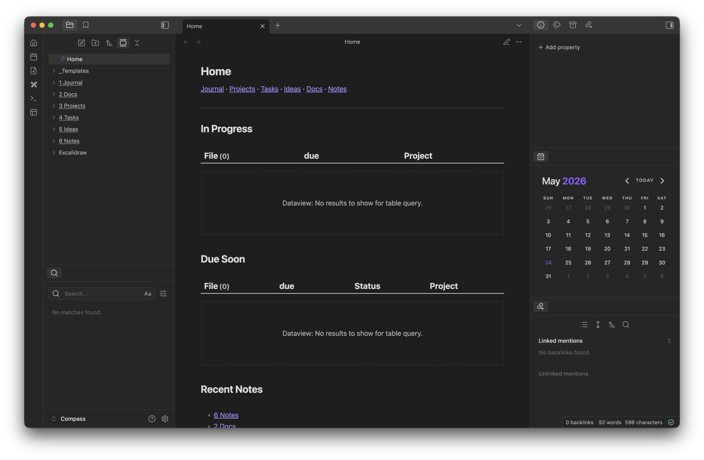

# obsidian-template

An Obsidian vault template for daily notes / journaling, project management, general task organization, ideas, and notes. Cross-platform and mobile-friendly.

[All Screenshots](/Screenshots/)

## Design

This vault was built to allow easy folder-based structure and templating between desktop and mobile. Many complex vault structures on desktop are not mobile friendly or use unsupported plugins, providing an inferior or broken mobile experience. This vault provides a preset of mobile-friendly plugins and configuration that enables easy use on any device.

Though the main structure is folder-based, seperate subfolders include a hybrid of folderless and folder-based organization.

Individual projects are stored in folders to group related files, while documentation and notes can be better organized with a linked structure.

Custom templates + QuickAdd automate the process of creating files and folders in the proper location. Templates include custom properties for use with the Obsidian Bases plugin. Bases are used for Projects, Tasks, and Ideas, and each Project has an individual task system.

TODO: Add some kind of kanban plugin/layout for project + task bases.

TODO: Templater for desktop templating automation. Enables simple templating for link-based file creation.

Templates are stored in the `_Templates` folder and use the stock Obsidian template scripting.

## Installation

To install:

1. Copy the contents of the `vault` folder to your preferred location.
2. Rename the folder to the name that you want for your vault.
3. Open the folder as a vault in Obsidian
4. Enable community plugins in the settings menu.
5. Refresh the plugin list, all plugins should appear.
6. Enable all plugins.

> [!NOTE]
> Plugin configuration is included in the vault and will automatically apply as the plugins are enabled.

> [!WARNING]
> Excalidraw does not seem to always load properly using this method and may crash when enabling. If this happens, uninstall and reinstall the plugin and you should be able to enable it.

If you are using Obsidian Sync, you will need to enable plugin syncing.

1. On the first device, navigate to Settings and open the Sync section.
2. Under the **Vault Configuration Sync** section, enable the `Active community plugin list` and `Installed community plugins` toggles at the bottom of the list.
3. On the new device, import the vault.
4. Repeat steps 1 and 2 on the new device.

You may see warnings appear by the 2 toggles after enabling them. I was able to clear these by pausing and resuming sync.

## Usage

On desktop, open the command palette using **CMD/CTRL + P** and type "Workspace". Select "Load Workspace Layout" and load the **Default** layout. This opens the active file properties in the right sidebar. These properties are hidden in the document, so this panel allows you to manage them.

This properties window can be added to mobile using the command palette and searching **Properties**. Select **Show file properties** to open the window in the right sidebar, where it will remain available.

To create a new Doc, Project, Idea, Task, or Note, use the **Quickadd: Run** command and select the type of note to create. This command can be accessed with the command palette on all platforms. It can also be pinned to the ribbon on desktop or the quick access menu on mobile.

## Extending

This vault structure can easily be extended with stock templates and is set up for excellent Base compatibility. QuickAdd settings sync between devices automatically, so adding complex new automations is fairly seamless between devices.

To add a new automation:

1. Add a template to the `_Templates` folder.
2. Open the QuickAdd settings and add a new Template automation.
3. Open the settings cog next to the new automation to customize it's settings, including folders and file names.
