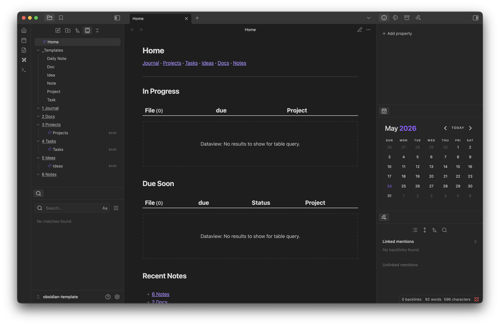

# obsidian-template

An Obsidian template for daily notes / journaling, project management with subtasks, task management, ideas, and notes. This vault uses mobile-compatible plugins for a seamless cross-platform experience.

## Design

This vault is primarily designed to use folders. Custom templates and QuickAdd scripts are used to automatically create files in the proper location. This also appends custom properties for use with the Obsidian Bases plugin. Bases are used for Projects, Tasks, and Ideas, and each Project has it's own base for project specific tasks.

TODO: Add some kind of kanban plugin/layout for project + task bases.

## Install

All configuration files for stock and community plugins are included in this repo.

To install, copy the contents of the `vault` folder to your preferred location. Rename the folder to the name that you want for your vault. Open the folder as a vault in Obsidian, and it should prompt you to install the required community plugins.

If this prompt does not appear, the full list of community plugins is available in `.obsidian/communityplugins.json`. All plugin configuration is included and will be applied after plugins are installed.

## Usage

To create a new Doc, Project, Idea, Task, or Note, use the QuickAdd command and select the type of note to create. Manually creating notes will not include the required frontmatter for Bases to function. These QuickAdd commands also work on mobile (TODO: testing)

## Customization + Notes

- The provided screenshot shows my layout customization.
- From the top down, the ribbon buttons are Homepage, Daily Note, QuickAdd, Excalidraw, and Command Pallete.
- The FileExplorer++ plugin is mainly used for pinning files in the file explorer.
